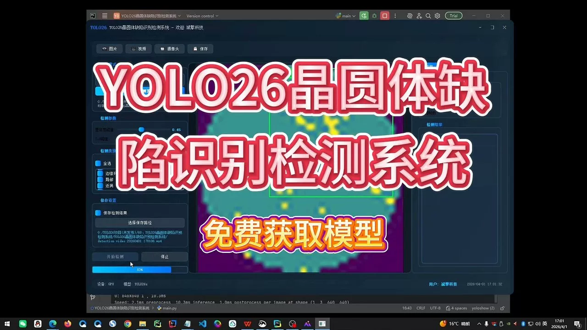
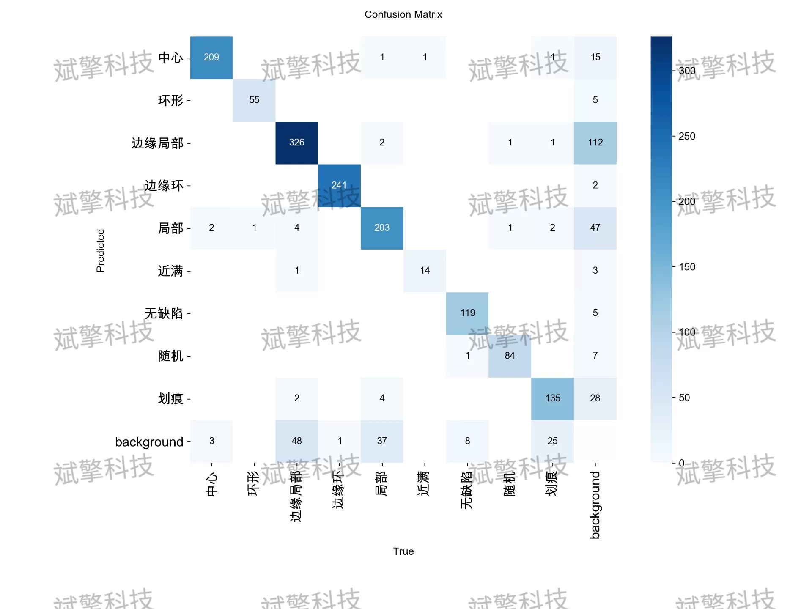
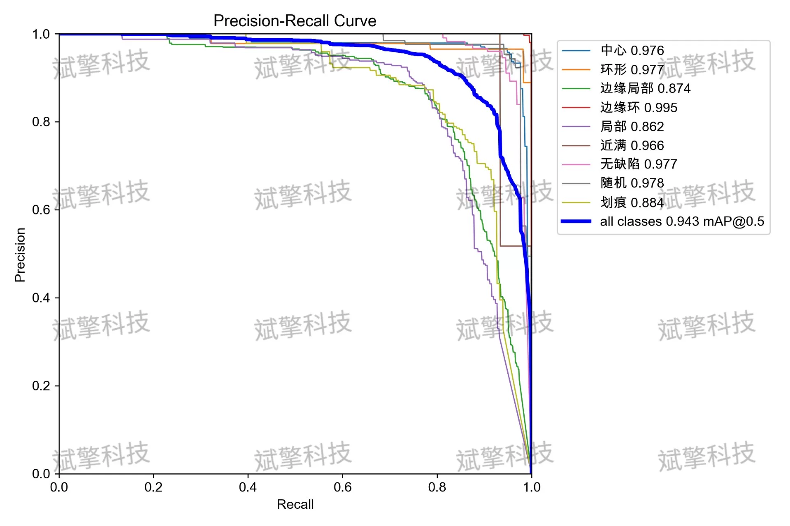
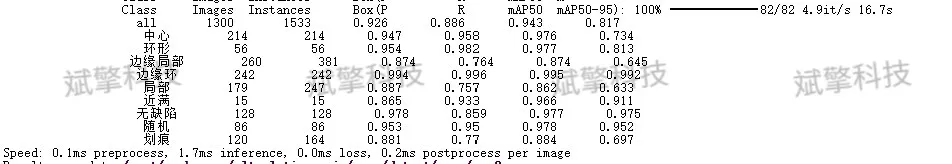
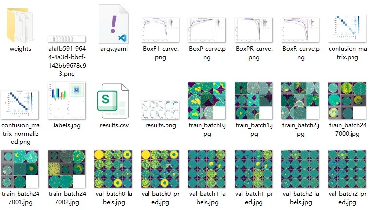
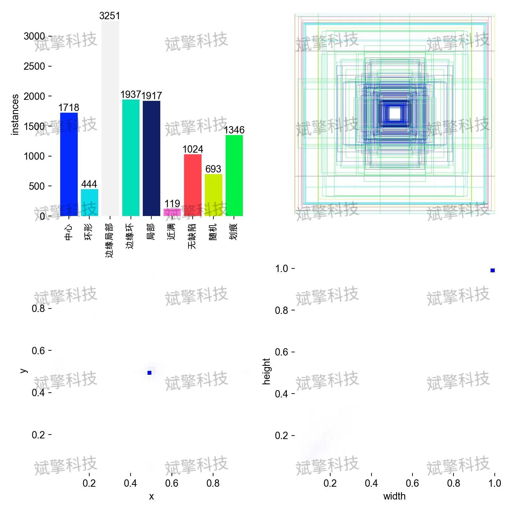
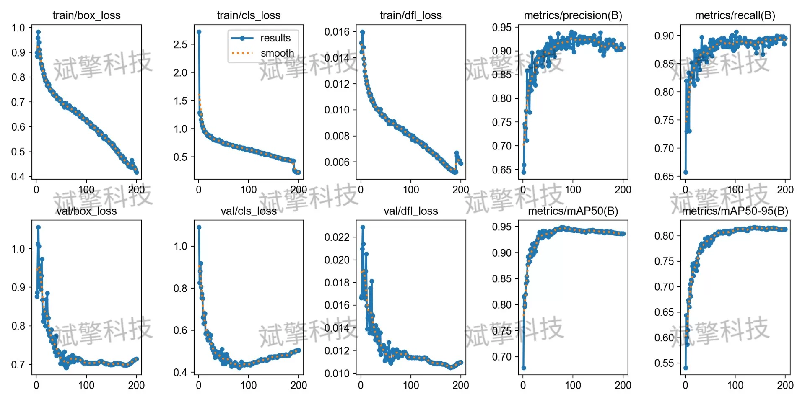
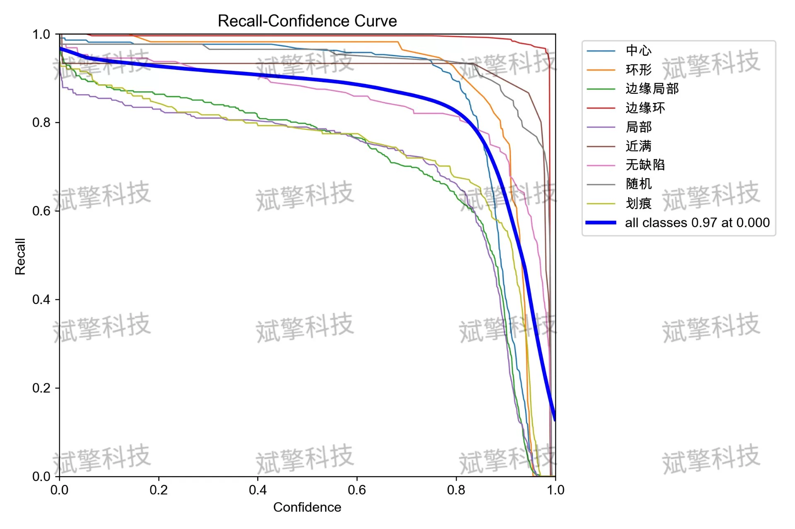
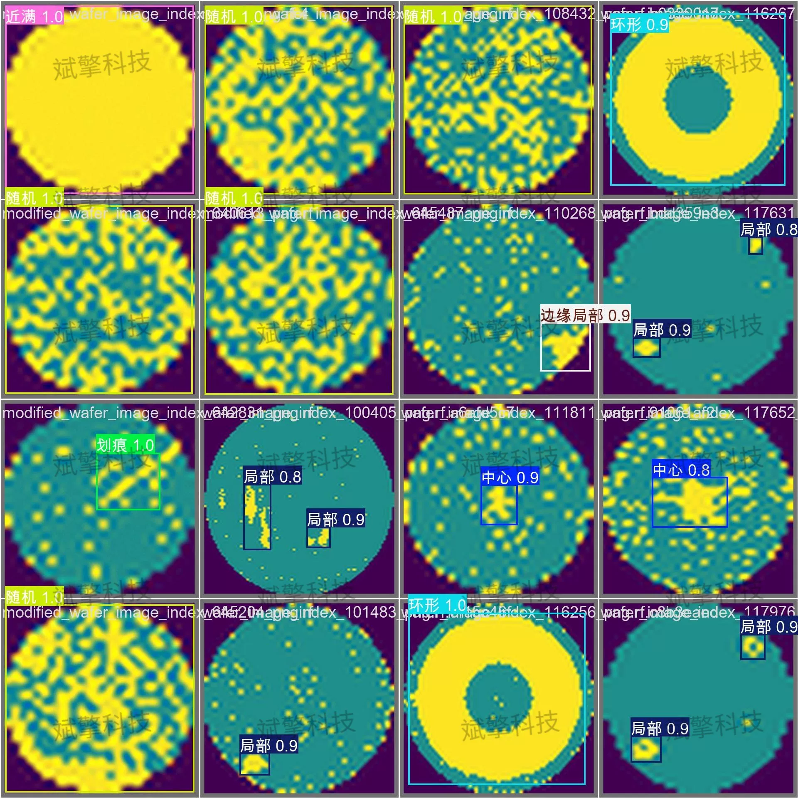

# YOLO26 wafer defect recognition detection system | dataset

## Body

YOLO26 Crystal Wafer Defect Detection System | Dataset Based on YOLO26 Deep Learning for Crystal Wafer Defect Identification Detection System (Project Source Code + Dataset + Model Weights + UI Interface + Python + Deep Learning + Remote Environment Deployment)

This study proposes and verifies an automated crystal wafer defect detection system based on the YOLO26 architecture, aiming to solve the complex defect recognition challenges in semiconductor manufacturing. The system has been trained and optimized for 9 typical crystal wafer patterns including center defects, ring defects, edge local defects, etc. The experimental dataset consists of a mixed dataset of 13,000 wafer images, with 10,400 training images, 1,300 validation images, and 1,300 test images. The experimental results show that the model achieves excellent performance on the validation set, with an average precision mean (mailto:mAP@0.5) reaching 0.943. Especially, the AP values for categories such as "edge rings", "no defect", and "ring" are close to 0.99. Although there is slight confusion in distinguishing between "local" and "scratch"-like defects, the overall detection speed and accuracy meet the industrial-grade online detection requirements, providing reliable technical support for improving the efficiency of wafer yield analysis.

The dataset contains 9 detection categories, covering various types of defects from simple geometric shapes to complex random distributions. According to the training set statistics, the number of instances in each category is as follows (some categories have sample imbalance issues, requiring the model to have strong robustness):
Center (center): about 1,716 instances.
Donut (ring): about 444 instances (with fewer samples, belonging to a long-tail distribution).
Edge-Loc (edge local): the most numerous, about 3,251 instances.
Edge-Ring (edge ring): about 1,937 instances.
Loc (local): about 1,917 instances.
Near-full (near full): about 119 instances (extremely scarce samples).
None (no defect): about 1,024 instances.
Random (random): about 693 instances.
Scratch (scratch): about 1,348 instances.
The dataset is strictly divided into training sets, validation sets, and test sets to ensure the objectivity of model evaluation. The specific distribution is as follows:
Training set: 10,400 images, used for learning and updating model weights.
Validation set: 1,300 images, used for monitoring model performance during training and adjusting hyperparameters.
Test set: 1,300 images, used for final assessment of the model's generalization ability.

Free remote installation reservation. Unsuccessful refund.
Purchase includes the following resources (Baidu Cloud automatically unlocks):
YOLO identification detection project complete source code
YOLO format dataset
Training code + UI interface code
Trained model + result images
Software installer
Add WeChat for remote installation reservation (automatically displayed after purchase) - Unsuccessful, full refund

⚙️ Core function modules
Detection capability
Image detection: upload and check immediately, returning detection boxes + category information
Video detection: supports video files, analyzes frames accurately
Camera real-time detection: connects USB camera to achieve dynamic monitoring
Interaction and control
Target selection: freely choose one or more categories for detection
Parameter real-time adjustment: adjustable confidence threshold & IoU threshold, flexible control of accuracy
Result saving: image/video/camera detection results saved easily
System and data
User login registration: Supports password strength checking + encryption storage
Log recording: automatically records operation and error information (timestamped)

## Images

## Payment

Here is a pay link on Stripe ( https://buy.stripe.com/3cs8yP7sY87d0vu9AB ). Please contact me lonlonago@foxmail.com after funding $89, and I will send you a complete data files , thank you!

